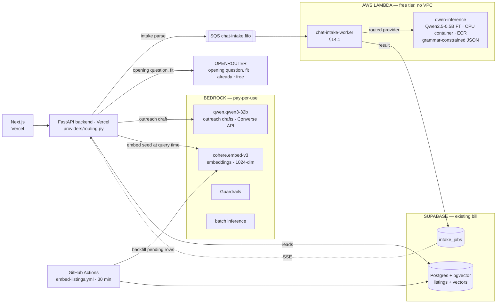
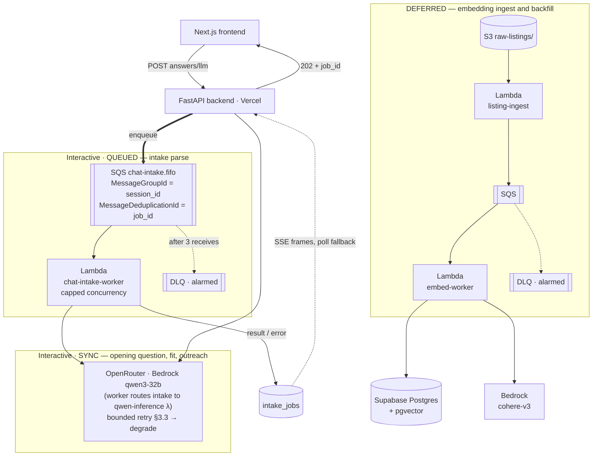

# LLM Platform Architecture — Qwen on Lambda + Bedrock

Status: in progress (Part I steps 1–3 implemented on `feat/bedrock-llm-platform`)
Scope: `backend/**`, deployment and infrastructure
Author: engineering

> Revision history: an earlier draft assumed a ~7B model on an always-on GPU. The actual model is
> **Qwen 0.5B fine-tuned for one task**, which runs on CPU. A later revision assumed a full AWS
> runtime migration; this one **deliberately stays on Vercel and avoids every service with a
> standing monthly cost** (§21). Filename kept so existing links resolve.
>
> **This revision moves to a Qwen-first chat plan:** Qwen2.5-0.5B (fine-tuned) is the **only**
> intake parser — no cross-family fallback; outreach drafting moves to **Qwen3-32B on Bedrock**
> (serverless, Converse API). Embeddings **stay on Bedrock `cohere.embed-english-v3`** — a
> Lambda-hosted Qwen3-Embedding-0.6B was considered and rejected (§6.1 records the comparison).
> The Sonnet chat provider stays built but unrouted.

---

## 0. The design in one table

| Workload | Runs on | Standing cost |
|---|---|---|
| **Criteria extraction** from free-text input (intake parse) | **Qwen2.5-0.5B fine-tune on AWS Lambda (CPU)** — the *only* model for this task | **$0** — perpetual free tier |
| **Embeddings** | **Bedrock** `cohere.embed-english-v3`, 1024-dim | **~cents/month** after §15 |
| **Outreach draft** | **Bedrock `qwen.qwen3-32b`** via the Converse API | pay-per-token, low $/mo |
| **Vector search** | **pgvector in the existing Supabase Postgres** | **$0** |
| **General chat** — opening question, fit | **OpenRouter** (today's provider) | ~$0 |
| **Fallback** when the Qwen Lambda fails | retry once, then degrade — **no cross-family fallback** (§3.3) | $0 |
| **Bulk/backfill** embedding jobs | **Bedrock batch inference** (S3 in/out) | one-off, ~50% rate |
| **Guardrails** on input/output | **Bedrock `ApplyGuardrail`** | per text unit, opt-in |
| **Intake turn dispatch** | **SQS FIFO → `chat-intake-worker` Lambda**, result over SSE (§14.1) | **$0** — free to 1M msg/mo |
| **API tier** | **Vercel** (unchanged) | current bill |

### Deliberately not using

Each of these has a standing monthly charge that buys nothing at current volume. They are not
rejected forever — §21 records what would justify each.

| Service | Why not | Would cost |
|---|---|---|
| **OpenSearch Serverless** | pgvector delivers the entire §15 win for $0 | **~$350–700/mo floor, regardless of traffic** |
| **Fargate + ALB** | Vercel already runs the API | ~$40/mo |
| **NAT Gateway** | No VPC ⇒ no NAT. Lambda runs outside a VPC and reaches AWS APIs over IAM-authenticated public endpoints | ~$32/mo + per-GB |
| **ElastiCache** | In-process and Postgres substitutes are adequate at this volume (§16) | ~$15/mo after the 12-month tier |
| **Bedrock chat (Sonnet 5)** | OpenRouter serves opening question + fit; outreach routes to Bedrock **Qwen3-32B** instead. Provider stays built, unrouted | ~$30/mo |
| **Qwen3-Embedding-0.6B on Lambda** | Considered for family purity; rejected — saves cents while adding a second container deployable, request-path cold starts, and a quantization-quality unknown (§6.1) | $0, but real ops cost |
| **Bedrock Marketplace / SageMaker endpoint for Qwen3-Embedding** | The only *managed* route to a Qwen embedding model is a provisioned endpoint billed per-hour — exactly the standing cost this design forbids | ~$100s/mo |
| **SageMaker** | Lambda's free tier is perpetual; SageMaker's is a 2-month trial | few $/mo |

### The picture



### Two tiers

| Tier | What | When |
|---|---|---|
| **Part I** (§1–§10) | Routing + Bedrock providers + the Qwen Lambda, behind the existing protocol seam | Now |
| **Part II** (§11–§22) | Ingest-time embeddings, queueing (§14.1 — the intake path moves behind SQS), observability — all within the free tier | Next |

---

# Part I — Providers and routing

## 1. Goals

- Serve the fine-tuned Qwen2.5-0.5B for criteria extraction, on CPU, inside the Lambda free tier —
  it is the **only** model for that task.
- Use Bedrock where it is nearly free (Cohere embeddings), where a bigger Qwen is worth paying per
  token (Qwen3-32B for outreach), or where it is uniquely useful (guardrails, batch).
- Route **per call site**, so cost is opted into per path rather than discovered on a bill.
- Keep OpenRouter/HF as the default for everything not explicitly moved.

Non-goals: streaming, agentic tool loops, replacing Supabase, any GPU, any standing monthly cost.

## 2. Current state

```
app/llm/{intake,fit,outreach}/service.py
        ├── generate_structured_output()  ── providers/chat.py ───────┐
        └── embed()                       ── providers/embeddings.py ─┤
                                        resolve_*_provider(config)    │
                                    ┌─────────────────┴──────────┐    │
                                    ▼                            ▼    │
                          OpenRouterProvider            HuggingFaceProvider
                          (llama-3.1-8b-instruct)       (all-MiniLM-L6-v2, 384-dim)
```

Two protocols, `ChatProvider` and `EmbeddingsProvider` (`providers/base.py`); nothing above the
seam touches a vendor SDK.

**One structural gap:** `resolve_chat_provider()` returns a *single* provider for all chat. Qwen
serves exactly one of four paths, so per-task routing is required. That is §3.

## 3. Model routing — the centerpiece

### 3.1 The routing table

The fine-tune covers **one** task. Everything else stays where it is.

| Call site | Code | Route | Standing cost |
|---|---|---|---|
| **Intake parse** | `llm/intake/service.py:63` | **Qwen2.5-0.5B FT (Lambda)** — only model, no substitution | $0 |
| Opening question | `llm/intake/service.py:102` | OpenRouter | ~$0 |
| Fit explanation | `llm/fit/service.py` | OpenRouter | ~$0 |
| **Outreach draft** | `llm/outreach/service.py` | **Bedrock `qwen.qwen3-32b`** | per-token |
| **Embeddings** | `services/similar_listings.py:41`, `services/listing_embeddings.py:47` | **Bedrock Cohere v3** | cents |

A 0.5B fine-tuned on one task can beat a general 8B *at that task* while being ~16× smaller —
that is the point. It will not transfer to the other three, and asking it to is the fastest way
to conclude the fine-tune "doesn't work." The converse also holds: intake parse routes to the
fine-tune and **nothing else** — a general model does not know the extraction format the
fine-tune was trained on, so substituting one on failure trades a visible error for a silently
wrong parse (§3.3).

Outreach is the one general path worth a bigger model: it writes prose a user sends to a real
agent, so quality is directly visible. Qwen3-32B on Bedrock is serverless pay-per-token — no
standing cost, and it keeps the whole plan in one model family.

**One provider is built but not routed.** `BedrockChatProvider` (Sonnet 5, §6.2) remains in the
registry as a one-env-var escape hatch; it costs nothing to keep. Note that it **cannot** serve
the Qwen3-32B route — it is built on the Anthropic SDK, which only speaks to Anthropic models.
Outreach needs the new `BedrockQwenChatProvider` (§6.2).

### 3.2 Implementation

```python
# app/llm/providers/routing.py  (new)
class LlmTask(StrEnum):
    INTAKE_PARSE     = "intake_parse"
    OPENING_QUESTION = "opening_question"
    FIT_EXPLANATION  = "fit_explanation"
    OUTREACH_DRAFT   = "outreach_draft"

def resolve_chat_provider_for_task(*, task: LlmTask | None = None,
                                   config: Settings | None = None) -> ChatProvider:
    """Route by task, falling back to `llm_route_default`, then to key-presence order."""
```

(`resolve_chat_provider` itself stays in `chat.py` doing key-presence only; the task-aware
resolver wraps it.)

One env var per task — routing changes are a redeploy, never a code change. **Defaults keep every
paid path off:**

```python
llm_route_intake_parse:     str = "auto"   # → "qwen" in phase D (Qwen2.5-0.5B Lambda)
llm_route_opening_question: str = "auto"   # stays OpenRouter via auto
llm_route_fit_explanation:  str = "auto"   # stays OpenRouter via auto
llm_route_outreach_draft:   str = "auto"   # → "bedrock_qwen" in phase E (Qwen3-32B)
llm_route_embeddings:       str = "auto"   # → "bedrock" in phase C (Cohere v3)
llm_route_default:          str = "auto"
```

`"auto"` defers to the key-presence order in `providers/chat.py`, which checks Bedrock **last**
(`chat.py:21-34` states the rationale: a metered provider must never silently displace a working
free one). An earlier draft defaulted these to `"openrouter"`; that was wrong — it would break any
deployment configured with only `HF_TOKEN`. `"auto"` gets the same "no metered path by accident"
outcome while keeping the change a genuine no-op.

Resolution order per task: **task pin → `llm_route_default` → auto**. An unknown name raises 503
and logs the bad value rather than falling back, so a typo cannot quietly send traffic to a
provider you did not choose.

`llm_route_embeddings` is not decorative: key-presence checks Bedrock last, so while `HF_TOKEN`
is set an explicit pin is the *only* way to reach Bedrock embeddings. The same holds for
`"bedrock_qwen"` on outreach.

Call sites gain one keyword argument:

```python
parsed_output = await generate_structured_output(
    messages=[...], response_format=LlmParseModelOutput,
    temperature=0.1, max_tokens=800,
    task=LlmTask.INTAKE_PARSE,          # ← new
)
```

Four one-line edits. `task` defaults to `None` → `llm_route_default`, so an un-annotated call site
still works.

**Import cycle to be aware of.** `routing.py` imports `chat.py` and `embeddings.py` for its
`"auto"` fallback, so the facades cannot import routing at module scope. They import it inside the
function body, and `LlmTask` is imported under `TYPE_CHECKING` so the annotation still resolves.
The alternative — extracting the key-presence resolvers into a third module — is more churn for
the same result; revisit only if the cycle grows.

### 3.3 Failure handling — retry, then degrade. No cross-family fallback

> **Decision (this revision): intake parse uses only the Qwen2.5-0.5B fine-tune.** Earlier drafts
> planned a fallback to Bedrock or OpenRouter when the Qwen Lambda failed. That is now ruled out:
> a general model was never trained on the extraction schema, so a "fallback parse" is a silently
> different parse — worse than an honest error the user can retry. What remains is *retry and
> degrade*, built in the same change as `QwenLambdaProvider`.

- On **infrastructure failure** — Lambda invoke error, timeout, throttle — retry **once** against
  the same function. Never retry a validation failure or refusal; that buys the same bad answer
  twice.
- If the retry fails: on the queued path (§14.1) the job goes back to `queued` and SQS redelivery
  is the retry budget; on the sync path the endpoint degrades gracefully — the user's text is
  preserved and they are asked to resend.
- **Infrastructure failures must be distinguishable from content failures.** Today
  `raise_bedrock_api_error` and `raise_bedrock_completion_parse_failed` both produce 502; a
  retryable marker (a `ProviderUnavailable` subclass, or a flag on the raisers) is a prerequisite
  for writing the retry clause honestly — and §14.1's worker classification reuses it.
- Log `retry_used=true` with the reason and alarm on the rate. A silent retry loop running for a
  week is how you discover the Qwen function has been broken since Tuesday.
- **Circuit breaker in-process** (per Vercel instance) rather than ElastiCache — see §16. When the
  breaker is open, fail fast with the degrade path rather than queueing invocations that will
  time out. It opens on 5 consecutive infrastructure failures and admits one probe per 30s
  window; a successful probe closes it, a failed one costs another window. **Only invoke-path
  failures count** — a reply that arrived and then failed validation proves the function is up,
  so content errors must never take a working service offline. An open breaker raises the same
  503 as throttling, which is what makes it retryable on the queued path (§14.1).

Outreach (Bedrock Qwen3-32B) and the OpenRouter paths are managed services with their own SLAs;
they get the ordinary §8 error mapping and no special machinery.

## 4. Target architecture

```
┌─────────────────────── FastAPI backend (Vercel) ─────────────────────────────┐
│                                                                              │
│  ┌───────────────┐ ┌───────────────┐ ┌───────────────┐ ┌──────────────────┐  │
│  │ intake/       │ │ fit/          │ │ outreach/     │ │ services/        │  │
│  │ service.py    │ │ service.py    │ │ service.py    │ │ similar_listings │  │
│  └───────┬───────┘ └───────┬───────┘ └───────┬───────┘ └────────┬─────────┘  │
│  task=INTAKE_PARSE  task=FIT_       task=OUTREACH_               │           │
│  task=OPENING_Q     EXPLANATION     DRAFT                        │           │
│          └─────────────────┴────────────────┘                    │           │
│                            ▼                                     ▼           │
│         ┌──────────────────────────────────┐   ┌────────────────────────────┐│
│         │ providers/chat.py                │   │ providers/embeddings.py    ││
│         │ providers/routing.py             │   └──────────────┬─────────────┘│
│         │  • per-task table       §3.1     │                  │              │
│         │  • retry on infra error   §3.3   │                  │              │
│         │  • in-process circuit breaker    │                  │              │
│         └────────────────┬─────────────────┘                  │              │
└──────────────────────────┼────────────────────────────────────┼──────────────┘
     ┌──────────┬──────────┴────────┬─────────────┐             │
     ▼          ▼                   ▼             ▼             ▼
┌───────────┐┌────────────┐  ┌────────────┐┌───────────┐ ┌──────────────────┐
│ QwenLambda││ BedrockQwen│  │ OpenRouter ││HuggingFace│ │ BedrockEmbeddings│
│ Provider  ││ChatProvider│  │  Provider  ││ Provider  │ │ Provider         │
├───────────┤├────────────┤  ├────────────┤├───────────┤ ├──────────────────┤
│ boto3     ││ boto3      │  │ openai SDK ││openai SDK │ │ boto3            │
│ lambda    ││ Converse   │  │            ││           │ │ bedrock-runtime  │
├───────────┤├────────────┤  ├────────────┤├───────────┤ ├──────────────────┤
│ Qwen2.5-  ││ qwen.      │  │ llama-3.1- ││ MiniLM    │ │ cohere.embed-    │
│ 0.5B GGUF ││ qwen3-32b  │  │ 8b         ││ 384-dim   │ │ english-v3       │
└───────────┘└────────────┘  └────────────┘└───────────┘ └──────────────────┘
 INTAKE PARSE  OUTREACH       OPENING Q,     current       EMBEDDINGS
  (phase D)    (phase E)      FIT            fallback      (phase C)

 (BedrockChatProvider · Sonnet 5 stays registered but unrouted — an escape
  hatch, not part of the plan.)
```

### New/changed files

| File | Status |
|---|---|
| `app/core/config.py` — AWS + Bedrock + route settings | ✅ steps 1, 6 |
| `app/llm/providers/exceptions.py` — `raise_bedrock_*` | ✅ step 2 |
| `app/llm/providers/bedrock_chat.py` — `BedrockChatProvider` | ✅ step 3 |
| `app/llm/providers/bedrock_embeddings.py` — `BedrockEmbeddingsProvider` | ✅ step 4 |
| `app/llm/providers/{chat,embeddings}.py` — add `"bedrock"`, route the facades | ✅ steps 5, 7 |
| `app/llm/providers/routing.py` — `LlmTask`, per-task resolution | ✅ step 6 |
| `app/llm/{intake,fit,outreach}/service.py` — `task=` kwarg | ✅ step 7 |
| `app/llm/providers/bedrock_qwen_chat.py` — `BedrockQwenChatProvider` (Converse API) | ✅ phase E |
| `backend/.env.example` — AWS, Bedrock, and route settings documented | ✅ phase C |
| Retry + circuit breaker (§3.3) | deferred — see below |
| `supabase/migrations/20260813_properties_embedding.sql` — pgvector column + HNSW | ✅ phase B |
| `app/db/property_row.py` — `embedding`, `embedding_model`, `embedded_at` | ✅ phase B |
| `app/repositories/properties.py` — write + k-NN + pending-row helpers | ✅ phase B |
| `app/services/similar_listings.py` — rewritten for k-NN | ✅ phase B |
| `app/services/listing_embeddings.py` + `scripts/backfill_embeddings.py` | ✅ phase B |
| `.github/workflows/embed-listings.yml` — 30-minute schedule | ✅ phase B |
| `app/llm/providers/qwen_lambda.py` — `QwenLambdaProvider`, retry (§3.3) | ✅ phase D |
| `infra/qwen-lambda/` — Dockerfile, handler, grammar build, README | ✅ phase D — weights still to supply |
| `backend/scripts/export_qwen_schemas.py` + drift test | ✅ phase D |
| `app/core/circuit_breaker.py` — in-process breaker (§3.3, §16) | ✅ phase D |

## 5. Hosting Qwen 0.5B on Lambda

### 5.1 Why CPU, and why Lambda

Qwen 0.5B is ~1 GB at bf16, ~500 MB at int8, ~350 MB at 4-bit, and criteria extraction emits only
~100–200 output tokens. That is a **CPU workload measured in seconds**. Once the GPU is gone the
requirement is: run occasionally, cost nothing when idle, need no cluster. That is Lambda, and its
free tier is **perpetual** — 1M requests and 400,000 GB-seconds every month, indefinitely.

At ~3 GB × ~2 s = 6 GB-s per call, that is roughly **65,000 free calls per month**.

**No VPC.** The function needs no private network access — it reaches nothing but the caller.
Keeping it outside a VPC avoids NAT Gateway entirely, which is the single largest avoidable cost
in an AWS deployment of this shape.

### 5.2 Container image and runtime

Lambda container images support up to 10 GB, so the weights ship **inside the image** — no
cold-start download, no EFS mount.

```
infra/qwen-lambda/
├── Dockerfile           # FROM public.ecr.aws/lambda/python:3.12
├── handler.py           # model loaded at module scope, reused across warm invocations
├── build_grammars.py    # JSON Schema → GBNF, run during the build
├── fetch_model.py       # pull the GGUF from Hugging Face, before the build
├── requirements.txt     # llama-cpp-python
├── requirements-build.txt
├── schemas/             # JSON Schemas exported from the Pydantic models
│   └── LlmParseModelOutput.json
├── grammars/            # produced by the build from schemas/ — not committed
└── model/
    └── qwen.gguf        # not committed; the image digest versions it
```

The schemas are exported by `backend/scripts/export_qwen_schemas.py`, keeping the
Pydantic model the single source of truth, and a backend test fails if the committed
copy drifts from it (§10).

**Runtime: `llama.cpp` (via `llama-cpp-python`) with a GGUF quant** — smallest image, `mmap`
weight loading, and native GBNF grammar support, which §5.3 depends on.

### 5.3 Constrained JSON output — non-negotiable

Small models are markedly worse at reliably emitting valid JSON. This is the biggest technical
risk in the plan, and it has a clean solution: **constrain the decoder** so invalid output is
impossible rather than unlikely.

```
Pydantic model  ──▶  JSON Schema  ──▶  GBNF grammar  ──▶  llama.cpp sampler
```

- Generate the grammar at **build time** and bake it into the image; `LlmParseModelOutput` only
  changes when you deploy.
- ⚠️ **The grammar constrains the envelope, not the answers.** There are two schemas on this path,
  and only one is static. `LlmParseModelOutput` — the five top-level fields — is a fixed Pydantic
  model, so it can be compiled into a grammar. The *per-question* schema that
  `build_intake_response_schema` renders is built from the `questions` table at request time and
  goes into the **prompt text** only. `extracted` therefore stays an open object in the grammar;
  the backend filters its keys against the questions that actually exist. Closing it would mean a
  grammar that silently drops answers whenever a question is added to the database.
- Still call `model_validate_json`. The grammar guarantees *shape*, not *sense*.
- On `ValidationError`: fail (§8's parse-failure raiser). **Do not retry** — the decoder was
  already constrained, so a second attempt re-earns the same error at full cost. Retry is for
  infrastructure failures only (§3.3).

Do not ship this relying on prompt instructions alone. It will pass testing and fail in production
on the inputs that matter.

### 5.4 Memory, CPU, and cold starts

Lambda allocates CPU in proportion to memory — ~1 vCPU at 1,769 MB, ~2 at 3,008 MB. More memory
means shorter duration, which can make a larger setting **cheaper overall**. Run Lambda Power
Tuning across 1,769 / 3,008 / 5,120 MB with a real intake prompt and pick from the measured curve.
Start at 3,008 MB.

**Cold start** is container init plus model load — a few seconds with `mmap`. Mitigation:
**EventBridge ping every 5 minutes** keeps one environment warm (~8,600 invocations/month, inside
the free tier). Provisioned concurrency bills continuously and defeats the reason we chose Lambda;
only if p99 becomes a stated requirement.

Also set timeout ~30 s and **reserved concurrency** as a cost blast-radius cap.

### 5.5 Provider implementation

```python
class QwenLambdaProvider:
    def __init__(self, *, settings: Settings, client=None):
        self.settings = settings
        self._client = client or boto3.client("lambda", region_name=settings.aws_region)

    async def generate_structured_output(self, *, messages, response_format, temperature, max_tokens):
        payload = {
            "messages": messages,
            "schema_name": response_format.__name__,   # selects the pre-built grammar
            "max_tokens": max_tokens,
            "temperature": temperature,                # ✅ Qwen honours this
        }
        raw = await anyio.to_thread.run_sync(partial(self._invoke, payload))
        return response_format.model_validate_json(raw["text"])
```

- **`temperature` works here**, unlike the Bedrock path (§6.2) which rejects it. That asymmetry is
  precisely why routing is per-task.
- boto3 is synchronous → `anyio.to_thread.run_sync` (via Starlette, no new dependency).
- Invoke over IAM rather than a Function URL — no public endpoint to secure.
- **`messages` is sent whole, system turn included** — a deviation from an earlier draft that
  reused `split_system_prompt`. The GGUF chat template renders roles itself, so splitting the
  system prompt out would only oblige the handler to reassemble it.
- ⚠️ **`FunctionError` must be checked.** A handler that raises still returns HTTP 200, with the
  stack trace as the payload. Skip the check and that trace reaches `model_validate_json`, where
  it surfaces as a parse failure — sending the retry logic after a content bug that is really an
  infrastructure one.

## 6. The paid models — Cohere embeddings, Qwen3-32B outreach

### 6.1 Embeddings — `cohere.embed-english-v3`

`bedrock-runtime` `InvokeModel`, versioned model IDs. `BedrockEmbeddingsProvider` is already
built and tested; phase C routes it.

**Decision record — why not Qwen3-Embedding-0.6B on Lambda.** A self-hosted Qwen embedder was
considered (family purity with the rest of this plan, $0 on the free tier) and rejected:

| | Cohere v3 (Bedrock) | Qwen3-Embedding-0.6B (Lambda CPU) |
|---|---|---|
| Dimensions | 1024 | 1024 native — either fits `vector(1024)` |
| Quality | strong, served at full precision | benchmark-comparable at full precision, but a GGUF quant on CPU erodes an unvalidated amount — and embedding degradation is *silent* (worse neighbours, no error) |
| Query-path latency | managed, no cold starts | a cold start adds seconds to similar-listings, a user-facing read |
| Cost | ~$0.00002/search — cents/month | $0 |
| Code | **zero** — provider exists with 18 tests | second container image, new provider, warmer, quant tuning |
| Backfill | ~96 texts/call + batch API at ~50% rate | CPU-bound, slow wall-clock |

Cents per month do not pay for a second deployable plus a silent-quality risk on the one path
where wrongness is invisible. Embeddings are also the least Qwen-specific choice here — nothing
downstream cares what produced the vectors. If non-English listings appear,
`cohere.embed-multilingual-v3` (same dims, same API) is the swap — at the price of a corpus
re-embed, since vectors from different models are never comparable (`embedding_model` provenance
exists exactly for this). §21 keeps Qwen3-Embedding as a recorded alternative with its trigger.

Implementation notes: chunk to `bedrock_embedding_batch_size` (96); **preserve order** —
the backfill (`listing_embeddings.py:47-54`) zips vectors positionally against listing rows and
hard-fails on a count mismatch, so a provider that reorders or drops silently mis-assigns every
vector; assert `len(vectors) == len(texts)` inside the provider too. (The query path embeds only
the seed — one text — so ordering bites the backfill, not the search.) Cohere v3 requires an
`input_type`; this is *symmetric* similarity (the query is itself a listing), so use
`search_document` on **both** sides — mixing types produces valid but mutually miscalibrated
vectors that no test will catch.

⚠️ **boto3 clients must be built lazily** (applies to every boto3-backed provider here).
`boto3.client()` *raises* on a blank region — `ValueError` for `""`, `NoRegionError` for `None` —
so an eager module-level client fails at import wherever `AWS_REGION` is unset, including CI.
Build on first use behind the region guard; tests pin it.

### 6.2 Outreach chat — `qwen.qwen3-32b` via the Converse API

Bedrock serves the Qwen3 chat family serverless, pay-per-token. Qwen3-32B (dense) is the fit for
outreach prose — the Coder variants and the 235B MoE are the wrong tool. **Check region
availability before phase E**: the Qwen3 models launched in a subset of regions, and the region
is shared with everything else in this document.

This needs a **new provider, `BedrockQwenChatProvider`** — the existing `BedrockChatProvider`
is built on the Anthropic SDK and can only call Anthropic models. Design points:

**(a) boto3 `bedrock-runtime` `converse`**, wrapped in `anyio.to_thread.run_sync` — the same
pattern as `bedrock_embeddings.py`, and the same lazy-client rule.

**(b) Structured output via a forced tool call.** Converse has no `messages.parse`. Define one
tool whose input schema is `response_format.model_json_schema()`, force it with
`toolChoice: {"tool": ...}`, and `model_validate` the returned `toolUse` input. On
`ValidationError`: one retry, then the §8 parse-failure error.

**(c) `temperature` is honoured** — unlike the Anthropic path, which drops it. Routing is
per-task precisely so these asymmetries stay inside providers.

**(d) Thinking off.** Qwen3 is a hybrid-thinking family; for a structured outreach draft,
thinking burns `max_tokens` for no benefit. Disable it via `additionalModelRequestFields` (and
verify against the deployed model — the switch is model-revision-specific).

**(e) `system` as a top-level parameter** — reuse `split_system_prompt`.

`BedrockChatProvider` (Sonnet 5) stays registered but unrouted, as before — an escape hatch if
Qwen3-32B's outreach quality disappoints, at ~$30/mo.

### 6.3 Batch inference

S3 JSONL in, S3 out, ~half the on-demand rate, separate quota pool. An option for the initial §15
embedding backfill if the corpus is large; the 30-minute pull schedule covers steady state either
way. One-off cost, no standing charge.

### 6.4 Guardrails

`ApplyGuardrail` evaluates text standalone, so one policy screens **both** the Qwen and Bedrock
paths. For a product collecting budget and personal circumstances in free text, PII redaction is
the one Bedrock feature that is genuinely hard to build yourself. Priced per text unit — opt in
when there is a launch date, not before.

## 7. Configuration and IAM

As implemented in step 1:

```python
# Region for both Bedrock clients. Required: neither boto3 nor the Anthropic Bedrock
# client applies a default. Credentials are resolved by the standard boto3 chain and
# so are not repeated in Settings.
aws_region: str = ""

bedrock_chat_model: str = "anthropic.claude-sonnet-5"   # escape hatch, unrouted
bedrock_effort: str = "low"
bedrock_disable_thinking: bool = True
bedrock_embedding_model: str = "cohere.embed-english-v3"  # routed in phase C
bedrock_embedding_batch_size: int = 96
bedrock_input_cost_per_1m: float = 0.0
bedrock_output_cost_per_1m: float = 0.0
```

Added by this revision (phases D–E):

```python
# Outreach chat on Bedrock (Converse API). Versioned ID, qwen. prefix.
bedrock_qwen_chat_model: str = "qwen.qwen3-32b-v1:0"
bedrock_qwen_disable_thinking: bool = True

# Intake-parse Lambda. Empty name disables the provider (503 via §8),
# mirroring how a missing region behaves.
qwen_inference_function_name: str = ""      # Qwen2.5-0.5B FT — intake parse
```

Planned by §14.1 (phase F — **not yet in `config.py`**):

```python
# FIFO queue carrying LLM intake turns to the Lambda consumer. Empty disables queueing
# and the endpoint runs the turn inline — which is what local dev and the test suite do.
sqs_chat_queue_url: str = ""
# How long an enqueued turn may sit unresolved before the SSE stream gives up. Must exceed
# visibility timeout x maxReceiveCount (180s x 3 = 540s), or a job still legitimately
# retrying looks dead to the client while SQS is still entitled to redeliver it.
chat_job_timeout_seconds: float = 600.0
chat_job_poll_interval_seconds: float = 0.75
```

> Deviation from earlier drafts: `aws_access_key_id` / `aws_secret_access_key` /
> `aws_session_token` are **not** Settings fields. Boto3 and the Anthropic Bedrock client already
> resolve credentials from the standard chain, so declaring them would duplicate credential
> handling. Only `aws_region` is configured, because it genuinely has no default.

| Environment | Credentials |
|---|---|
| Local dev | `~/.aws/credentials` profile or `.env` |
| **Vercel** | Dedicated IAM **user** key pair in project env vars |

Least-privilege policy, resources enumerated — the guardrail that stops a config typo from
invoking a far more expensive model:

```json
{
  "Version": "2012-10-17",
  "Statement": [
    { "Effect": "Allow", "Action": ["bedrock:InvokeModel"],
      "Resource": [
        "arn:aws:bedrock:<region>::foundation-model/cohere.embed-english-v3",
        "arn:aws:bedrock:<region>::foundation-model/qwen.qwen3-32b-v1:0"
      ] },
    { "Effect": "Allow", "Action": ["lambda:InvokeFunction"],
      "Resource": "arn:aws:lambda:<region>:<acct>:function:qwen-inference-prod" },
    { "Effect": "Allow", "Action": ["sqs:SendMessage"],
      "Resource": "arn:aws:sqs:<region>:<acct>:chat-intake.fifo" }
  ]
}
```

The escape-hatch model (Sonnet 5) is **not** in the policy — least privilege means a route flip
to it is an IAM change too, which is the point: no config typo can invoke a model that was never
granted.

The **API** role sends only. The `chat-intake-worker` **execution** role is separate and gets the
receive side plus its own invoke rights — the API has no reason to consume the queue, and
splitting them means a compromised Vercel key cannot drain pending turns. Intake turns run on the
Qwen inference Lambda, so the worker invokes that, not Bedrock:

```json
{
  "Version": "2012-10-17",
  "Statement": [
    { "Effect": "Allow",
      "Action": ["sqs:ReceiveMessage", "sqs:DeleteMessage", "sqs:GetQueueAttributes"],
      "Resource": "arn:aws:sqs:<region>:<acct>:chat-intake.fifo" },
    { "Effect": "Allow", "Action": ["lambda:InvokeFunction"],
      "Resource": "arn:aws:lambda:<region>:<acct>:function:qwen-inference-prod" }
  ]
}
```

Queue settings that are not defaults and matter:

| Setting | Value | Why |
|---|---|---|
| Queue type | **FIFO**, high-throughput mode | per-session ordering (§14.1); dedupe on `job_id` |
| `visibilityTimeout` | **180s** | must exceed `BR_READ_TIMEOUT` (75s) plus retries, or a still-running turn is redelivered |
| `maxReceiveCount` | **3** → DLQ | bounded redelivery; alarm on DLQ depth |
| Event source concurrency | **capped** | Lambda scaling must not outrun the Bedrock quota (§13.1) |

### Dependencies

```
anthropic[bedrock]>=0.40.0
boto3>=1.35.0
```

In **both** `pyproject.toml` and `requirements.txt` — the Vercel runtime installs from
`requirements.txt` and they are hand-synced. `llama-cpp-python` lives in the Lambda container
image, not in the backend's dependencies.

⚠️ **Cold-start budget.** `boto3` + `botocore` add ~15–20 MB to a Vercel bundle already carrying
`openai`, `supabase`, `sqlalchemy`, `asyncpg`. Measure; if it hurts, import `boto3` lazily inside
the provider constructors.

## 8. Error mapping

Implemented in step 2.

| Condition | Raiser | HTTP |
|---|---|---|
| `aws_region` unset | `raise_bedrock_not_configured` | 503 |
| Model access not enabled (403) | `raise_bedrock_access_denied` | 503 |
| Throttling / `RateLimitError` | `raise_bedrock_rate_limited` | 503 |
| Timeout (either SDK) | `raise_bedrock_request_timeout` | 504 |
| Any other upstream failure | `raise_bedrock_api_error` | 502 |
| `ValidationError` on the reply | `raise_bedrock_completion_parse_failed` | 502 |
| `stop_reason == "refusal"` | `raise_bedrock_structured_refusal` | 502 |
| `stop_reason == "max_tokens"` | `raise_bedrock_structured_reply_incomplete` | 502 |
| SQS `SendMessage` fails (§14.1) | `raise_service_unavailable` | 503 |
| Unknown/foreign `job_id` (§14.1) | `raise_intake_job_not_found` | 404 |

§14.1 reuses this table's *classification* — retryable (503/504) vs terminal (502) — but not
only its rows: the worker also touches OpenRouter for the next-question generation, so the
OpenRouter/HF raisers need the same retryable/terminal assignment before the worker's catch
clauses can be written (see §14.1).

Chat and embeddings reach Bedrock through different SDKs, so `BedrockTimeout` and
`BedrockCallFailure` union both. User-facing copy is identical across providers — pinned by a test.

## 9. Telemetry

Keep the `llm_call` record compatible with `openrouter.py:89-101` so SolarWinds ingestion and
existing dashboards survive:

```
provider="qwen"|"bedrock_qwen"|"bedrock"|"openrouter", model=...,
task="intake_parse", outcome=..., duration_ms=..., prompt_tokens=...,
completion_tokens=..., total_tokens=..., cache_read_input_tokens=...,
estimated_cost_usd=..., retry_used=false, model_version="qwen-ft-2026-01"
```

`task` and `model_version` are what let you answer "did the retrain regress intake parsing?"
without a deploy.

## 10. Testing

Every provider takes an injectable client, so no network access is required.

| Test | Asserts |
|---|---|
| `test_routing::*` | ✅ 19 test functions (more collected via parametrize) — per-task pins, fall-through to default, auto, unknown-pin raises, table coverage |
| `test_bedrock_chat::*` | ✅ 16 tests — system split, temperature dropped, thinking off, stop-reason mapping, error mapping |
| `test_bedrock_embeddings::*` | ✅ 18 tests — batching, **input order preserved**, lazy client, botocore error mapping |
| `test_bedrock_qwen_chat::*` | ✅ 22 tests — forced tool call, **temperature forwarded**, thinking flag on/off, missing/foreign tool call, refusal and botocore error mapping, lazy client |
| `test_exceptions::test_user_facing_copy_does_not_vary_by_provider` | ✅ copy pinned across providers |
| `test_chat::test_forwards_task_to_the_router` | ✅ a dropped `task=` kwarg fails loudly |
| `test_routing::test_infra_error_triggers_retry` | deferred with §3.3 — retry same function only, never another provider |
| `test_qwen_lambda::*` | ✅ 22 tests — payload contract, **`temperature` forwarded**, `FunctionError` caught before parsing, retry once on transient / never on content, error mapping |

⚠️ **A trap that bit three times.** Test config helpers build a bare `MagicMock`, whose unset
attributes are truthy — so an unset credential looks configured and an unset route looks pinned.
Every `_config` helper now sets all credentials *and* all route settings explicitly. Any new
`Settings` field read during resolution must be added to those helpers.

| `test_qwen_handler::*` | ✅ 13 tests — the image handler's half of the payload contract, `llama_cpp` stubbed. Both sides of the contract break the same suite |
| `test_qwen_schema_export::*` | ✅ 5 tests — the committed JSON Schema still matches the Pydantic model, and `extracted` stays open |

Plus a **grammar conformance test in the Lambda image build**: generate N outputs from the real
model under the grammar and assert every one validates. Still to do — it needs the weights. The
export drift test above covers the schema half of that risk without them.

§14.1 adds three tests that are worth naming, because each pins a decision that is invisible in
the code and easy to regress:

| Test | Pins |
|---|---|
| second delivery of a claimed job is a no-op | the conditional `queued → running` claim — the only thing standing between redelivery and a double provider charge |
| queue-disabled mode returns the same `202` contract | that no test or local dev needs a queue, so the fallback path cannot silently rot |
| transient raisers requeue, terminal raisers do not | the §8 classification the worker depends on |

Ordering itself is **not** unit-testable — it is a FIFO queue guarantee, not application logic. What
the tests can pin is that the publisher always sets `MessageGroupId` to the session id; if that
assertion ever goes green on a null group, ordering is gone and nothing else would notice.

---

# Part II — Scaling within the free tier

## 11. What actually needs fixing

| Limitation today | Consequence |
|---|---|
| `find_similar_listings` embeds up to **101 texts per request** | Re-embeds the same listings forever; cost and latency scale with pool size |
| No queue on the intake path | A slow provider call becomes a user-visible 5xx **and loses the user's typed answer** — addressed by §14.1 |
| No caching | Every identical prompt pays full price |

**§15 is the highest-impact item in this document and costs nothing.** Note what is *not* on this
list: model capacity. A 0.5B on Lambda scales horizontally by default, and Bedrock quotas only
bind the embedding path.

## 12. Capacity

The ceiling is **Lambda account concurrency** (default ~1,000 per region, raisable), not GPU
capacity or a quota you must negotiate.

```
peak_requests_per_sec × seconds_per_request  =  concurrent executions needed
```

At ~2 s per intake parse, 1,000 concurrency serves **~500 requests/sec** — far beyond plausible
near-term traffic. Request an increase when approaching it. That is the whole capacity plan.

## 13. Runtime stays on Vercel

The API tier does not move. Vercel already provides the edge, TLS, deploys, and preview
environments, and moving to Fargate + ALB + NAT would add roughly **$70/month** to run the same
code.

What this means concretely:

- **No VPC.** Lambda functions run outside a VPC and reach Bedrock and each other over
  IAM-authenticated public endpoints. No NAT Gateway, no VPC endpoints to configure.
- **No RDS Proxy.** Supabase's pgbouncer transaction mode already handles connection pooling, and
  `db_serverless` (`config.py:22-27`) is already wired for it.
- **No in-process model hosting.** §5.6's "fold the 0.5B into the API container" endgame requires a
  long-lived container; on Vercel the model stays in its own Lambda. That is fine — it is free
  either way.

§21 records what would justify revisiting this.

### 13.1 The Lambda inventory

> **The Qwen functions and `chat-intake-worker` are the planned ones.** Phase B shipped
> embedding as a GitHub Actions pull schedule (§15), so none of the *ingest* Lambdas below
> were built — they would have duplicated the ingestion microservice. They stay recorded
> because they are the right shape *if* ingestion moves onto AWS, not because anything is
> pending. `chat-intake-worker` is different: it is on the critical path for §14.1 and is
> the first function here that must actually exist for a user-facing flow to work.

| Function | Trigger | Job | Status |
|---|---|---|---|
| **`qwen-inference`** | `lambda:Invoke` from the API / worker | **Run the 0.5B FT, return grammar-constrained JSON** | phase D |
| `qwen-warmer` | EventBridge, every 5 min | Keep one environment warm (§5.4) | phase D |
| **`chat-intake-worker`** | SQS `chat-intake.fifo` | **Run one intake turn, write the result to `intake_jobs`** | phase F — §14.1 |
| `listing-ingest` | S3 `ObjectCreated` on `raw-listings/` | Normalise feed → upsert row → enqueue embed | not built — §15 |
| `embed-worker` | SQS | Bedrock Cohere v3 → write vector | not built — §15 |
| `batch-manifest-builder` | EventBridge (nightly) | Pending listings → JSONL → S3 → `CreateModelInvocationJob` | not built |
| `batch-result-loader` | EventBridge (job completion) | Read S3 results → write vectors | not built |

All within the free tier. Two constraints apply to every queue-driven function here — and, with
§14.1, they stop being hypothetical:

- **Cap event-source concurrency** so Lambda's willingness to scale cannot outrun the provider
  quota. Uncapped, the queue's only effect under load is to deliver the overload faster.
- **Idempotency keys.** SQS redelivery is normal; without a dedupe check a retry burns a second
  provider call for a result you already have. §14.1 uses the `intake_jobs` row and its
  conditional `queued → running` claim; the ingest path would need its own.

The embedding pull schedule sidesteps both: it re-selects rows by state rather than consuming a
queue, so a re-run cannot double-charge, and concurrency is one job. That escape hatch is not
available to intake, which is why §14.1 has to solve both properly.

## 14. Queue and backpressure

SQS is free to 1M requests/month — comfortably beyond current volume.



| Class | Path | Under pressure |
|---|---|---|
| **Interactive, queued** — intake parse | SQS FIFO → Lambda → provider; client reads the result over SSE | Backlog absorbs the burst. Visible as latency, not as a 5xx |
| **Interactive, sync** — opening question, fit, outreach | Sync → OpenRouter / Bedrock Qwen3-32B | Bounded retry (§3.3); then degrade |
| **Deferred** — embedding ingest and backfill | SQS → Lambda → Bedrock | Queued. No user impact |

Mechanics: visibility timeout > worst-case latency; `maxReceiveCount` → DLQ + CloudWatch alarm;
capped event-source concurrency; idempotency keys.

Fit explanation and outreach draft stay synchronous. They are one-shot generations with no shared
mutable state, so they gain far less from queueing than intake does and would each need their own
job surface. §21 keeps the trigger.

### 14.1 Intake turns through SQS

**Reversal.** Earlier drafts of this section kept every interactive path synchronous. Intake parse
is now queued. What changed is not the capacity argument — §12 still holds, and a queue adds
buffering rather than throughput — but the failure mode: a provider stall on the intake path
currently surfaces as a 5xx mid-conversation, and the user's typed answer is lost. A durable job
row makes the turn survivable and gives redelivery something to be idempotent against.

Be clear about what this does **not** buy. It does not raise the Bedrock quota, it does not make a
slow turn fast, and under sustained overload it converts a fast rejection into a growing wait.
The queue protects the *user's input*; admission control protects the *provider*. They solve
different problems and neither substitutes for the other.

✅ **Admission control shipped first, before any queue** (`app/core/intake_admission.py`). An
earlier draft claimed the existing `ApiKeyRateLimiter` protects the provider; the audit found that
limiter guards only MCP API-key routes (`core/deps.py:37`), leaving both LLM-backed intake routes
unmetered. Today that costs a burst of provider calls; behind a queue it would cost more, because
every accepted request becomes a durable job the worker will faithfully pay for — the backlog keeps
spending after the flood stops. This is what keeps the queue a buffer rather than an amplifier.

**Correction to the audit:** it called for "verify the caller owns the intake session". There is no
such check to write. `create_intake_session_row` writes no user id and `search_profile_id` is null
until completion, so **intake sessions are anonymous by design** and the session UUID *is* the
credential. Adding ownership would mean requiring sign-up before the conversation, a product change
rather than a security fix. What exists instead:

| Control | Scope | Why |
|---|---|---|
| Per-address window (60/min) | both LLM intake routes | Sessions are free to mint, so a per-session limit alone is no defence — the caller just starts another. This is the real ceiling |
| Per-session window (12/min) | turns only | Paces one conversation; a human types far slower |
| Metered at **session creation** too | `?mode=llm` only | Broader than the audit noted: creating an llm session runs the opening-question model, so a session is not free either. Guided mode calls no provider and stays unthrottled |

Two known limits, both deliberate. The windows are **per process**, so the effective ceiling scales
with instance count — the same trade §16 accepts for the circuit breaker, and the failure mode is a
caller getting somewhat more than their share rather than an unbounded amount. And the address is
read from `X-Forwarded-For`, which is only trustworthy because the platform overwrites it; exposed
without a trusted proxy, that limit becomes advisory while the per-session one does not.

Still to come with the jobs table: a **cap on in-flight turns per session** (one is the natural
limit — FIFO ordering per `MessageGroupId` already implies it), which needs somewhere to count and
so lands with `intake_jobs`.

#### The contract

`POST /intake-sessions/{id}/answers/llm` stops returning the turn result:

| | Before | After |
|---|---|---|
| `POST .../answers/llm` | `200 SubmitLlmIntakeInputResponse` | `202 {job_id, status}` |
| Result delivery | the same response | SSE `GET .../jobs/{job_id}/stream` |
| Fallback | — | `GET .../jobs/{job_id}` poll, if the stream drops |

The SSE stream is the primary channel and polling is the fallback, not the reverse: a dropped
EventSource with no fallback strands a job that has already been paid for.

#### FIFO, not standard — the one non-negotiable

`save_intake_criteria` merges each turn into the session's accumulated criteria. Two turns for one
session processed concurrently, or out of order, silently overwrite each other's extractions — the
user answers a question and watches the answer disappear.

So: **FIFO queue, `MessageGroupId = session_id`.** Ordering is guaranteed within a group, and
groups are independent, so different sessions still process fully in parallel — the ordering
guarantee costs no throughput that matters here. `MessageDeduplicationId = job_id` makes a retried
publish inside the 5-minute window a no-op.

**The message carries references, not content** — just `{job_id, session_id}`. The row written
before the publish already holds the user's text, and the consumer must load it anyway, so putting
the input in the body would copy free-text personal circumstances into a second store with its own
retention for no gain. §18 makes the same argument about inference logging.

Ceiling: FIFO in high-throughput mode does ~3,000 msg/s with batching (~70M/day (roughly)), well
past the ~500 req/s §12 derives from Lambda concurrency. FIFO is not the binding constraint.

#### `public.intake_jobs`

One row per turn. It is the result store *and* the idempotency ledger — §13.1 already requires the
latter for any queue-driven path, and SQS at-least-once delivery makes it mandatory rather than
prudent.

| Column | Note |
|---|---|
| `id`, `session_id` | `session_id` scopes reads, so a job id alone cannot read across sessions |
| `status` | `queued` → `running` → `succeeded` \| `failed` |
| `input` | the user's text, so a redrive can replay the turn |
| `result jsonb` | the `SubmitLlmIntakeInputResponse` payload |
| `error`, `attempts` | `attempts` surfaces a redelivery loop before the DLQ does |

Two details worth pinning:

- **The claim is the idempotency gate.** The worker moves `queued → running` with the update
  filtered on `status = 'queued'`. A redelivered message whose job already ran matches no row, and
  the worker drops it instead of paying for a second provider call.
- **`attempts` increments in a trigger**, not in the worker. PostgREST cannot express
  `attempts = attempts + 1`, and a read-then-write from the consumer races concurrent redelivery —
  two consumers would both read N and both write N+1. Counting the `queued → running` transition
  server-side keeps it exact.
- **A claimed job needs a way out.** The claim gate means a worker killed mid-turn — Lambda
  timeout, OOM — leaves a row stuck in `running` that redelivery can no longer rescue, because the
  conditional update no longer matches. Without a sweeper the client waits out its whole timeout on
  a job that is already dead, so `expire_stale_running_jobs` fails those rows once they stop being
  touched. This was not in the original §14.1 design; the claim gate implies it.

Rows are written **before** the SQS publish. A row with no message is visible and retryable; a
message with no row is undiagnosable when the consumer picks it up.

#### The worker

`chat-intake-worker` consumes the FIFO queue and calls the same pipeline the endpoint used to run
inline — extracted to `app/services/intake_llm.py` (✅) so it imports nothing from FastAPI's request
machinery. Failures still surface as `HTTPException`, because the repositories and providers raise
it; that is the point rather than a leak, since the status code *is* the retryable/terminal
vocabulary the worker classifies on.

Failure classification decides redelivery, and getting it backwards is expensive in both
directions:

| Fault | Job lands on | Why |
|---|---|---|
| Throttling, timeout (503/504 raisers) | back to `queued` | transient; let redelivery retry it |
| Refusal, parse failure, incomplete reply | `failed` | deterministic; redelivery burns quota re-earning the same error |

⚠️ The classification must cover **every provider the turn touches, not just §8's Bedrock
raisers**: an intake turn runs the parse on the Qwen Lambda *and* generates the next question via
OpenRouter (`service.py:102`), so the OpenRouter/HF raisers (`raise_ai_unavailable` and friends)
need retryable/terminal assignments too — and the worker bundle needs the OpenRouter key in its
environment, which the packaging list below must include.

The handler reports **partial batch failures** (`batchItemFailures`) so one poison message does not
redrive its whole batch.

#### Queue-disabled mode

An empty `SQS_CHAT_QUEUE_URL` runs the turn inline and writes a terminal job row. The client
contract is byte-identical either way — still `202`, still a job to follow — so local dev and the
existing test suite need no queue, and no test is rewritten to accommodate one.

#### Where the code lands

| File | Change |
|---|---|
| `supabase/migrations/20260814_intake_jobs.sql` | ✅ table, RLS, indexes, `attempts` trigger |
| `app/repositories/intake_jobs.py` | ✅ create / get / claim / complete / fail / count-active / expire-stale |
| `app/services/intake_llm.py` | ✅ `run_llm_intake_turn()`, extracted from the endpoint |
| `app/clients/sqs.py` | ✅ `ChatJobQueue`, boto3 via `anyio.to_thread` per `bedrock_embeddings` |
| `app/repositories/intake_jobs.py` | new — create / get / claim / complete / fail |
| `app/workers/chat_job_worker.py` | new — the Lambda handler |
| `app/core/intake_admission.py` | ✅ new — per-address and per-session windows on both LLM intake routes |
| `app/core/rate_limit.py` | ✅ `ApiKeyRateLimiter` generalised to `SlidingWindowRateLimiter` (alias kept) |
| `app/api/.../answers/llm.py` | ✅ admission dependency wired; POST still to become insert + enqueue + `202` |
| `app/api/.../answers/jobs.py` | new — SSE stream + poll endpoints |
| `app/schemas/intake_sessions.py` | `EnqueuedLlmIntakeJobResponse`, `IntakeJobStatusResponse` |
| `frontend/services/intake-sessions.ts` | `enqueueLlmInput`, `subscribeToJob` |
| `frontend/hooks/use-intake-job.ts` | new — EventSource lifecycle, polling fallback on `onerror` |
| `frontend/components/search/wizard/modes/llm/panels/chat/index.tsx` | `handleSend` holds its optimistic message until the job resolves |

#### The cost this choice carries

The consumer cannot live on Vercel — there is no long-lived process to run a receive loop, and §13
pins the API tier there. Lambda is therefore the only shape available without reopening §13, and
it means **packaging a second deployable**: `app/llm`, `app/services`, `app/repositories`,
`app/domain`, `app/schemas` plus boto3, anthropic and supabase. Provider configuration and the
Supabase service-role key now have to exist in two places, and drift between them is a new failure
mode that did not exist before this section.

## 15. Vector search on pgvector — the biggest win, for $0

**Before phase B:** every similar-listings request embedded the seed plus up to 100 candidates,
then computed cosine similarity in Python (`app/domain/similarity.py`). The same listings were
re-embedded on every request, forever.

**Now (phase B ✅):** each listing is embedded **once at ingest**; at query time only the seed is
embedded (`similar_listings.py:41`) — one provider call regardless of corpus size.

```
INGEST  (off the request path — runs once per listing, ever)   ✅ implemented

┌────────────────────────┐  upsert   ┌────────────────────────┐
│ ingestion microservice │──────────▶│ Supabase Postgres      │
│ (PostgREST, no LLM)    │           │ properties row         │
└────────────────────────┘           └───────────┬────────────┘
                                                 │ selected by
                                                 │ embedding IS NULL
                                                 │ OR model superseded
┌────────────────────────┐  every     ┌──────────▼─────────────┐
│ GitHub Actions         │  30 min    │ backfill_listing_      │
│ embed-listings.yml     │───────────▶│ embeddings()           │
└────────────────────────┘            └──────────┬─────────────┘
                                                 │ embed(texts=[...])
                                                 ▼
                                      ┌────────────────────────┐
                                      │ Bedrock cohere-v3      │
                                      │ 1024-dim vectors       │
                                      └──────────┬─────────────┘
                                                 ▼
                                      ┌──────────────────────────────────┐
                                      │ properties.embedding             │
                                      │ vector(1024) + HNSW index        │
                                      │ — same Postgres, no new service  │
                                      └──────────────────────────────────┘

  **Pull, not push.** Listings are written by the ingestion microservice, which has no
  LLM providers; embedding there would duplicate the provider layer, routing and AWS
  deps into a second deployable. The backfill already selects rows with no vector *or*
  one from a superseded model, so "new listing" and "model changed" are the same case
  and no ingest-path change is needed. The workflow runs the script against the database
  rather than calling a trigger endpoint: no new public surface, and a real backlog would
  exceed the serverless function timeout.

  The S3 → Lambda → SQS → embed-worker pipeline sketched in §13.1 is the shape this takes
  *if* ingestion itself moves onto AWS. It is not needed for the pull schedule, and the
  30-minute window is a product decision, not a technical limit.


QUERY  (request path — one embedding call, regardless of corpus size)

┌────────────┐   ┌────────────────┐   ┌──────────────────────────────────────┐
│ seed       │──▶│ 1 embed call   │──▶│ pgvector k-NN                        │
│ listing    │   │ (Bedrock)      │   │ WHERE state/city/property_type match │
└────────────┘   └────────────────┘   │ ORDER BY embedding <=> $1 LIMIT k    │
                                      └──────────────────────────────────────┘
```

| | Today | With ingest-time embeddings |
|---|---|---|
| Embedding calls per request | up to **101** | **1** |
| Similarity | Python, over a 40–100 row pool | HNSW index, over the whole corpus |
| Quality | capped by the pre-filtered pool | true nearest neighbours corpus-wide |

**Two behaviours worth knowing when reading the implementation:**

- **State scopes eligibility, not rank.** The seed's state filters which rows can appear; the
  final list is sorted by score. Concatenating the scoped query with the widening query would
  otherwise put a weaker in-state match above a stronger out-of-state one, and a score column
  that goes back down then up reads as a bug to users.
- ⚠️ **Filtered HNSW can under-return.** pgvector scans `hnsw.ef_search` index candidates and
  *then* applies the `WHERE`, so a filtered query can return fewer rows than actually match —
  here that surfaces as the widening path firing when it shouldn't. Raise `hnsw.ef_search`
  (default 40) or enable `hnsw.iterative_scan` on pgvector ≥ 0.8 if results look short in a
  dense state. It is a property of the index, not the data.

The quality gain is not incidental: `DEFAULT_CANDIDATE_POOL = 40` means the true nearest neighbour
may never enter the ranking at all.

**pgvector, not OpenSearch.** The win is *ingest-time embedding*, not the index technology.
pgvector lives in the Postgres you already pay for; OpenSearch Serverless would add ~$350–700/month
for the same result at this corpus size. §21 records the trigger for revisiting.

**No `VectorIndex` protocol.** With a single implementation, an abstraction layer would be
speculative. Put the upsert and k-NN query in `app/repositories/properties.py` alongside the
existing `list_similar_candidate_rows`, matching how the rest of the codebase is organised. Extract
a protocol only if a second store ever appears.

**Migration:** the `vector(1024)` column and HNSW index shipped in phase B, and Cohere v3's
1024 dims fit it unchanged; the backfill runs through the existing pull schedule (or Bedrock
batch, §6.3, if the corpus warrants it). Dimension is fixed by the model; changing it later
means a new column and a full re-index, so treat the choice as durable.

## 16. Caching without ElastiCache

| Layer | Where | Cost |
|---|---|---|
| **Opening-question cache** | Postgres table keyed by question row + prompt hash | $0 |
| **Circuit breaker state** (§3.3) | ✅ In-process per instance — `app/core/circuit_breaker.py` | $0 |
| **Bedrock prompt caching** | `cache_control` on stable prefixes, if Bedrock chat is ever routed | $0 |
| CloudFront / edge cache | Vercel already provides it | included |

In-process breaker state is less precise than a shared one — each serverless instance learns
independently that the Qwen function is down. At this volume that is an acceptable trade for
avoiding a standing ~$15/month, and the failure mode is mild (a few extra failed calls before each
instance trips).

The opening-question path is the only genuinely cacheable one — it is deterministic given a
question row. Intake parse is user-specific and will rarely hit.

## 17. Data layer

Supabase Postgres stays the system of record, and now also the vector store (§15).

`db_serverless` already enables NullPool and disables prepared statements for pgbouncer transaction
mode (`config.py:22-27`) — the connection-pooling problem is already solved for Vercel's execution
model. No RDS Proxy, no Aurora migration.

`qwen-inference` touches no database at all, which is one more reason the model-on-Lambda /
API-on-Vercel split stays clean.

## 18. Storage — S3 and ECR

Model weights ship **inside the Lambda container image**, which lives in **ECR**, not S3. The image
digest *is* the version, so **rollback = redeploy the previous tag**.

| Store | Contents | Cost |
|---|---|---|
| **ECR** | `qwen-inference` images — weights, runtime, grammars | ~$0.10–0.20/mo |
| S3 `raw-listings/` | Ingestion feed; triggers `listing-ingest` | cents |
| S3 `batch-inference/{input,output}/` | Transport for Bedrock batch (§6.3) | cents, expire after days |
| S3 `eval/golden-sets/` | Fixed intake prompts + expected criteria — the retrain gate | negligible |

**Not doing yet:** `model-invocation-logs/` and inference capture. Beyond the CloudWatch cost,
those record **full prompts and completions** — for this product that means budget, location, and
personal circumstances. Enabling capture "for debugging" and forgetting creates a durable PII store
nobody scoped. If it is ever enabled: sample, set a lifecycle expiry, encrypt with SSE-KMS,
restrict read access separately, and run Guardrails redaction *before* the write.

## 19. Observability

CloudWatch Logs is free to 5 GB/month ingest — adequate, with retention set.

- Lambda metrics: duration, billed duration, concurrent executions, cold-start rate, errors,
  throttles.
- Keep the existing SolarWinds shipping (`swo_logs_url`) and the `llm_call` shape (§9).
- **Skip X-Ray and Firehose/Athena for now** — both add cost for observability the current volume
  does not need.

Alarms that matter: **`retry_used` rate**, Qwen p99 duration and cold-start rate, Lambda
throttles, SQS depth and DLQ depth, Bedrock error rate.

**Abuse control:** per-tenant budgets enforced in application code — the defence against one
account or a compromised key consuming the Bedrock budget. Pure application logic; nothing in AWS
does it for you, and it costs nothing to add. Note this is the *second* layer: the first —
admission control on the anonymous intake routes — now exists (§14.1). Budgets cap what a
identified account can spend; admission control bounds traffic that has no identity to bill.

## 20. Cost summary

| Component | Monthly |
|---|---|
| Lambda (`qwen-inference` + workers + warmer) | **$0** — perpetual free tier |
| SQS | **$0** — perpetual free tier |
| pgvector | **$0** — existing Supabase |
| Bedrock embeddings (Cohere v3) | **cents** — ~$0.00002/search after §15 |
| Bedrock `qwen.qwen3-32b` (outreach) | **low $** — pay-per-token, volume-bound |
| CloudWatch Logs | **~$0** — 5 GB free |
| S3 | **cents** |
| ECR | **~$0.10–0.20** |
| OpenRouter (opening question, fit) | current bill, ~$0 |
| **Total added** | **a few $/month, all usage-based — no standing charges** |

One-off: the embedding backfill, through the pull schedule or Bedrock batch (~50% of on-demand),
priced by corpus size.

Largest savings levers, already applied: ingest-time embeddings (§15), pgvector over OpenSearch
(§15), Vercel over Fargate+NAT (§13), in-process caching over ElastiCache (§16), and keeping
opening question + fit on OpenRouter (§3.1).

## 21. Deferred decisions and their triggers

Recorded so the reasoning is not lost, and so the trigger is explicit rather than a vibe.

| Deferred | Cost if adopted | Adopt when |
|---|---|---|
| **OpenSearch Serverless** | ~$350–700/mo floor | pgvector HNSW maintenance degrades write throughput on the primary, **or** hybrid keyword+vector search becomes a product requirement |
| **Fargate + ALB + NAT** | ~$70/mo | Vercel's function timeout or bundle limit blocks a needed feature, **or** you want the 0.5B in-process to remove a network hop |
| **ElastiCache** | ~$15/mo | Per-instance circuit breakers cause visible flapping, **or** a shared rate limiter becomes necessary for per-tenant budgets |
| **Bedrock chat (Sonnet 5)** | ~$30/mo | Qwen3-32B outreach quality, or OpenRouter quality on opening/fit, measurably hurts conversion |
| **Qwen3-Embedding-0.6B on Lambda** | $0 + a second deployable + full re-embed | Embedding spend becomes a real line item, or an offline/air-gapped requirement appears — vectors from different models never mix, so this is a corpus re-embed, not a flag flip (§6.1) |
| **Fit/outreach behind SQS** | $0 infra, real product work | p95 latency on those endpoints becomes a complaint. Intake already moved (§14.1); these did not, because they are one-shot generations with no shared mutable state |
| **Polling-only instead of SSE** | negative — it is cheaper | Held-open SSE connections on Vercel become a visible line item (§14.1) |
| **X-Ray, Firehose/Athena** | usage-based | Debugging a latency problem that CloudWatch cannot explain |
| **Multi-region** | doubles most line items | A stated availability SLO |

## 22. Rollout

| Phase | Work | Cost |
|---|---|---|
| ✅ **A — Routing layer** | Bedrock chat + embeddings providers, `routing.py`, `LlmTask`, `task=` on 4 call sites. Every route still `auto` | $0 |
| ✅ **B — Ingest-time embeddings** | `vector(1024)` column + HNSW, repository write/k-NN helpers, `find_similar_listings` rewritten, batched backfill + script, 30-minute workflow | $0 |
| **C — Bedrock embeddings** | Set `LLM_ROUTE_EMBEDDINGS=bedrock` and run the backfill. **No code** — but required before similar-listings returns anything, since the 384-dim HF model cannot fill the column | cents |
| **D — Qwen 0.5B intake on Lambda** | ✅ **code complete**: `qwen_lambda.py` (contract, retry-once, error mapping, breaker), `circuit_breaker.py`, `infra/qwen-lambda/` image with build-time GBNF and HF fetch, schema export + drift test, 62 tests. Remaining is deployment only: **supply the weights** (§23.1 — fine-tune vs base undecided), build/push, warmer, memory tuning, then route `intake_parse=qwen` | $0 |
| **E — Outreach on Bedrock Qwen3-32B** | ✅ code: `BedrockQwenChatProvider` (Converse, forced tool call), `"bedrock_qwen"` registered pin-only, settings, 22 tests. Deploy pending: region check, IAM grant, `LLM_ROUTE_OUTREACH_DRAFT=bedrock_qwen` | per-token |
| **F — Intake turns through SQS** | ✅ admission control (the blocker, §14.1), ✅ `intake_jobs` migration + repository (claim gate, `attempts` trigger, stale-claim sweeper), ✅ pipeline extracted to `intake_llm.py`, ✅ `ChatJobQueue` publisher, 64 tests. Remaining: `chat-intake-worker` Lambda, `202` + SSE endpoints, frontend job hook | $0 — SQS free to 1M/mo |
| **G — Guardrails** | `ApplyGuardrail` on intake input/output before launch | per text unit |

**Phase C is a deploy step, not a development step**, and it gates B: until embeddings are routed
to Bedrock there are no vectors, and `find_similar_listings` excludes rows without one. Order of
operations on first deploy: apply the migration → set the route → run the backfill → verify
similar-listings.

**A and B are free and account for most of the value**, and C costs cents; D and E are
independent of each other and of C.

**F is independent of C–E** — it changes how an intake turn is dispatched, not which provider runs
it, so it works against whatever `llm_route_intake_parse` currently resolves to. It is also the
only phase that changes a client-facing contract, so it is the one that cannot ship backend-first.
Sequence it after the frontend job hook is merged behind the queue-disabled default, then set
`SQS_CHAT_QUEUE_URL` to switch dispatch on.

## 23. Open questions

1. **Quantisation and measured latency** — which GGUF quant, and p50/p99 at 3,008 MB on a real
   intake prompt? Every number in §12 and §20 follows from this. Benchmark before phase D.
2. **Does the grammar path hold?** (§5.3) The single largest technical risk. Prove it against the
   real schemas early.
3. **Qwen3-32B region availability and Converse structured output** — confirm `qwen.qwen3-32b`
   is servable in the chosen region, that thinking can be disabled there, and that the forced
   tool call (§6.2) yields schema-valid outreach drafts at an acceptable rate. Benchmark before
   phase E.
4. **Retrain promotion gate** — a golden set in `eval/golden-sets/` and a pass threshold, so
   `model_version` telemetry (§9) has something to gate on.
5. **Cold start tolerance** — is a few-second p99 on the first request after idle acceptable?
6. **Listing corpus size** — decides whether pgvector HNSW is comfortable and when §21's OpenSearch
   trigger might fire.
7. **What does queueing intake do to perceived latency?** (§14.1) The turn now costs an enqueue, a
   Lambda cold start, and an SSE round trip on top of the provider call. If that is materially
   worse than today's synchronous path at p50, the queue is buying durability at a price the user
   feels on every message. Measure before phase F ships to anyone.
8. **SSE cost and connection ceiling on Vercel** — held-open connections bill for wall-clock and
   are capped by function duration. Unknown whether the fallback is the exception or the norm under
   real traffic; §21 records polling-only as the retreat.
9. **Does `chat-intake-worker` justify a second deployable?** It duplicates provider config and the
   Supabase service-role key into a Lambda bundle (§14.1). If that drift becomes a recurring
   incident source, §21's Fargate row is the alternative that collapses it back to one runtime.
