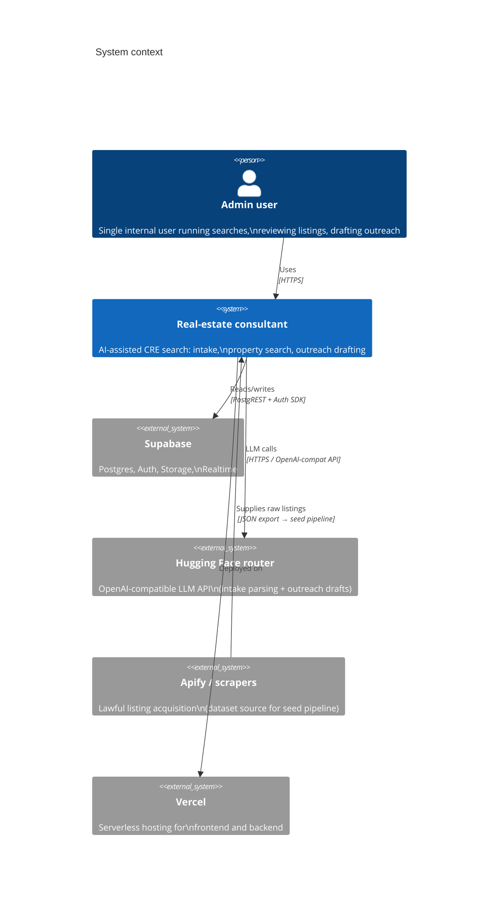
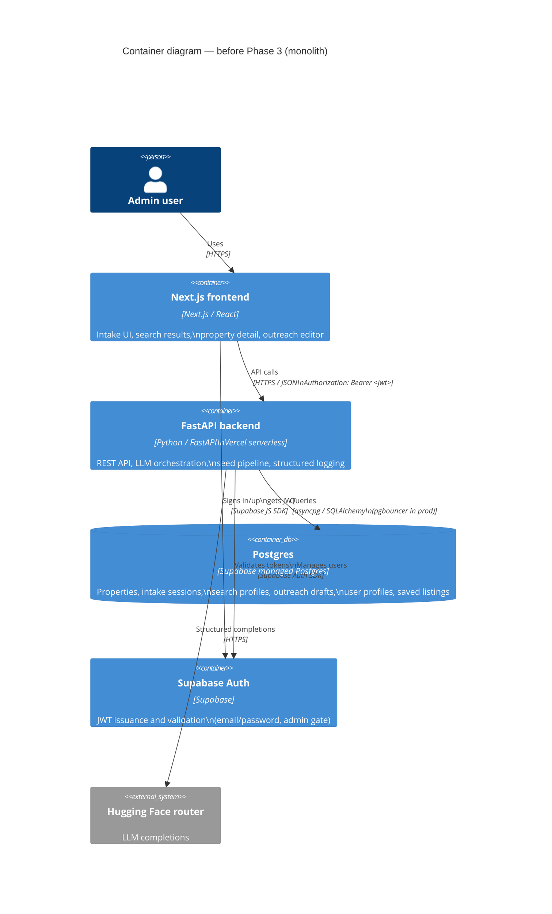
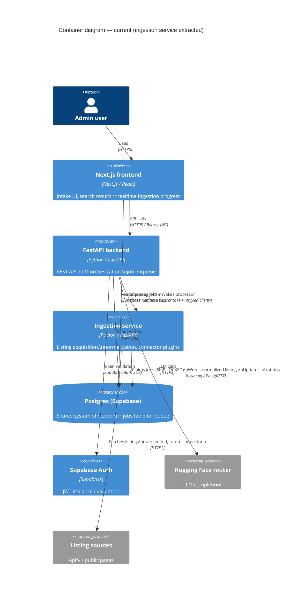
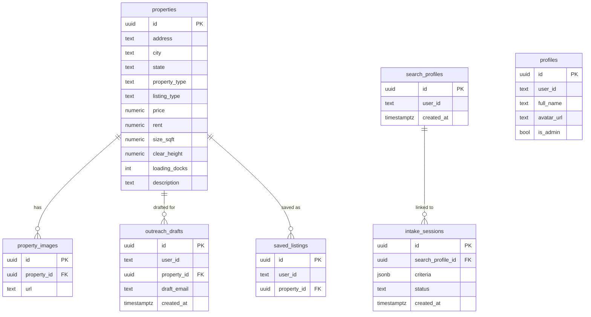
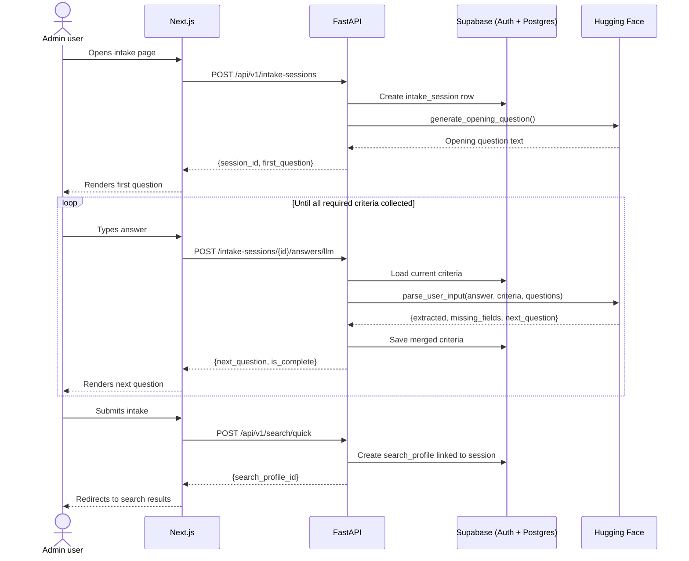
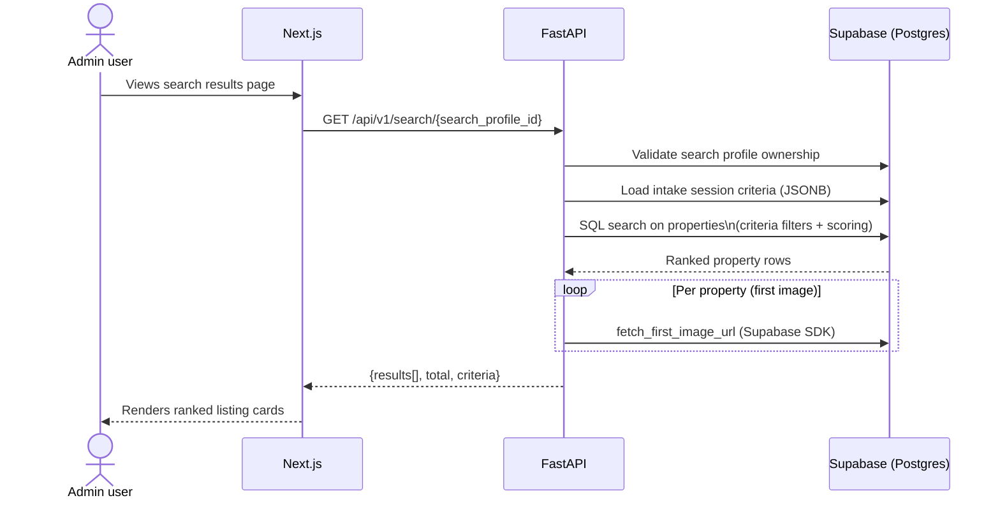
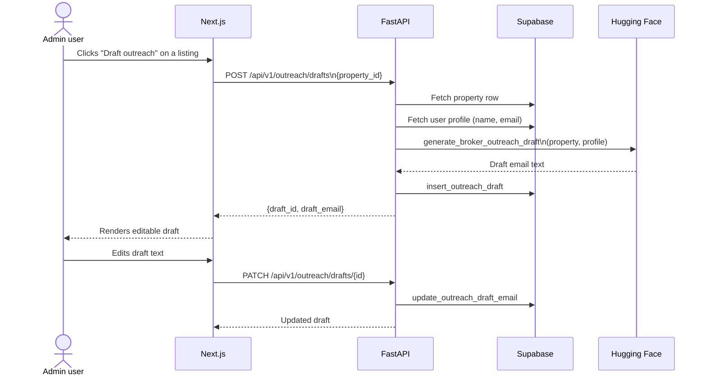
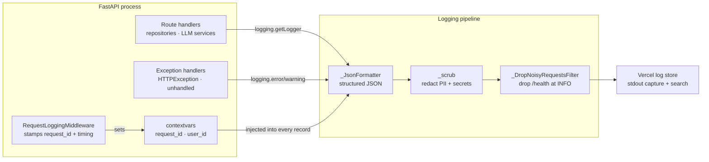

# Architecture

C4-style overview of the real-estate consultant system — current state, including
the microservice split done in Phase 3 of the skills roadmap.

---

## 1. Context (C4 Level 1)

Who and what interacts with the system.



---

## 2. Containers (C4 Level 2)

Deployed units and their relationships.

### Before Phase 3 (monolith)



### Current (Phase 3): ingestion service extracted



---

## 3. Key data models



---

## 4. Request flows

### 4a. Intake flow (qualification chatbot)



### 4b. Search flow



### 4c. Outreach flow



---

## 5. Logging pipeline (Phase 1)

Every backend request produces structured JSON log events that flow through
a normalisation layer before landing in Vercel's log store.



**Normalised event schema** (every log line):

| Field | Source |
|-------|--------|
| `timestamp` | `_JsonFormatter.formatTime` |
| `level` | log level name |
| `logger` | `logging.getLogger(__name__)` |
| `message` | log message |
| `request_id` | `RequestLoggingMiddleware` via `contextvars` |
| `user_id` | auth dependency via `contextvars` (when authed) |
| `method`, `path`, `status`, `duration_ms` | `request_completed` / `request_slow` events |
| `provider`, `model`, `outcome`, `duration_ms`, `*_tokens`, `estimated_cost_usd` | `llm_call` events |
| `source`, `fetched`, `normalized`, `rejected`, `rejected_reasons` | `ingestion_run` events |

---

## 6. Job queue and live progress (Phase 3.3–3.5)

Vercel functions have a 10–60 s hard kill; a connector run that fetches and
LLM-extracts dozens of listings cannot fit in one request. A `jobs` table
in Supabase decouples enqueue (backend, fast) from processing (ingestion
service, long-running).

```mermaid
flowchart TD
  A[Admin triggers ingestion\nPOST /api/v1/admin/ingest] --> B[Backend enqueues job\nINSERT INTO jobs]
  B --> C[Returns {job_id} immediately]
  B --> W[Backend calls ingestion\nPOST /api/v1/jobs/process\nvia typed client - best effort]
  C --> D[Frontend subscribes\nSupabase Realtime on jobs row\nadmin-only RLS policy]

  W --> F{claim_next_job\nFOR UPDATE SKIP LOCKED}
  E[Vercel cron, every 15 min\nfallback if the wake call fails] --> F
  F -->|status = pending -> running| D
  F --> G[Run connector\ne.g. loopnet-seed]
  G --> H[Normalize listings]
  H --> I[Upsert into properties\n+ property_images]
  I --> J[UPDATE jobs\nstatus = done/failed, result jsonb]
  J --> D
```

**`jobs` table schema:**

| Column | Type | Purpose |
|--------|------|---------|
| `id` | `uuid` PK | Job identifier returned to frontend |
| `source` | `text` | Connector name (e.g. `loopnet-seed`) |
| `status` | `text` | `pending` → `running` → `done` / `failed` |
| `attempts` | `int` | Retry counter (max 3, then `failed`) |
| `idempotency_key` | `text` | One active job per source per day |
| `result` | `jsonb` | `{fetched, normalized, rejected, rejected_reasons, duration_ms}` on success |
| `error` | `text` | Error message on failure |
| `created_at` / `updated_at` | `timestamptz` | Enqueue / last-transition time |

**Realtime (3.5):** `public.jobs` has RLS enabled with an admin-only `SELECT`
policy (`profiles.is_admin = true`) and is added to the `supabase_realtime`
publication with `REPLICA IDENTITY FULL`. The frontend's `/admin/ingest` page
subscribes to `postgres_changes` (`UPDATE`, filtered to the triggered job's
`id`) using the browser Supabase client + user JWT — no polling.

---

## 7. Service boundaries rationale

| Split | Why here |
|-------|----------|
| Frontend ↔ Backend | Different languages (TS/Python), deploy cadences, and team concerns; Next.js BFF pattern naturally owns the UI shell |
| Backend ↔ Ingestion service | Ingestion is long-running (exceeds serverless timeout), independently deployable, and failure-isolated from the user-facing API — a connector bug cannot crash the auth or search flows |
| Shared Postgres as integration point | Avoids distributed transactions; Supabase Realtime gives the frontend live job updates without a separate message bus |
| Backend ↔ Ingestion contract (3.6) | The backend's `app/clients/ingestion` Pydantic models are generated from the ingestion service's OpenAPI schema (`scripts/generate_ingestion_client.py`); CI regenerates and diffs them, so a breaking response-shape change fails the build instead of surfacing as a runtime error in `wake_processor()` |
| Connector plugins ↔ shared infrastructure (3.7) | Each source is a `ConnectorBase` subclass registered by name (e.g. `loopnet-seed`); the job queue, retry/backoff, and `RateLimitedFetcher` (semaphore + token bucket) are shared, so adding a new source means writing one connector, not a new service |

### Modular connectors

The ingestion service's `_CONNECTORS` registry (in `app/api/ingest.py` and
`app/api/jobs.py`) maps a job's `source` string to a `ConnectorBase`
subclass. `claim_next_job()` doesn't know or care which connector runs —
it just records `source`, `status`, `attempts`, and `result`. Today's only
connector (`LoopNetSeedConnector`) reads a local dataset; a future
HTTP-fetching connector (e.g. live LoopNet pages, a second source) drops in
alongside it and reuses:

- the same job queue, idempotency key, and retry/backoff (3.3)
- the same service-to-service auth (3.4)
- the same Realtime progress reporting (3.5)
- `RateLimitedFetcher` for a per-source concurrency cap + polite request rate (3.7)

This is the "modular connectors" principle from the spec: new lawful
ingestion sources are additive, not architectural changes.

See `docs/slo.md` for availability targets and `docs/runbook.md` for incident response.
