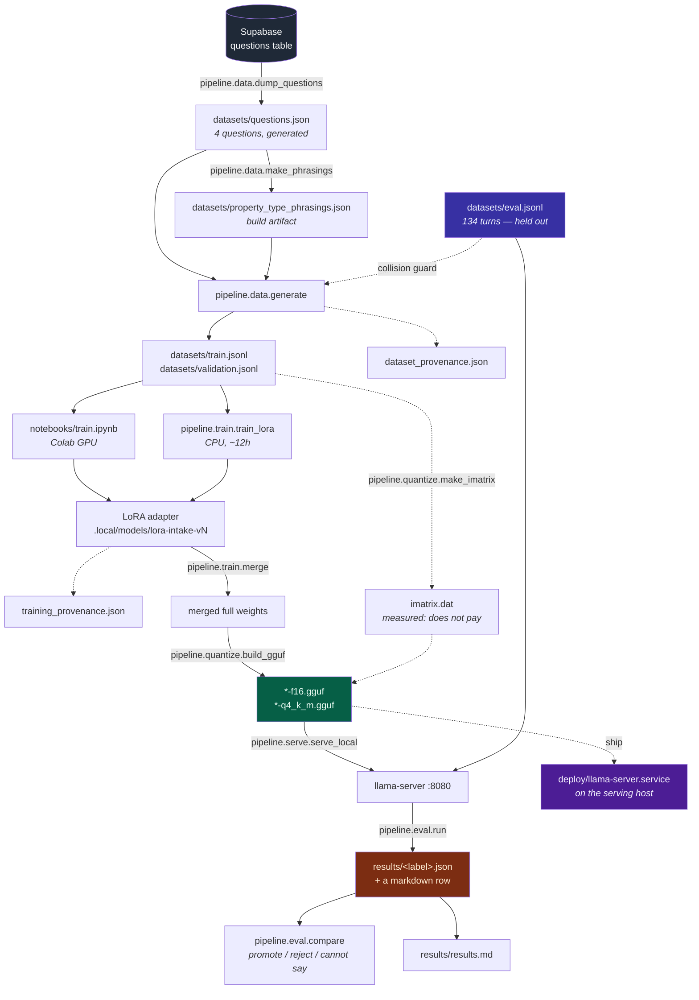
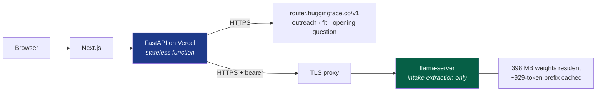
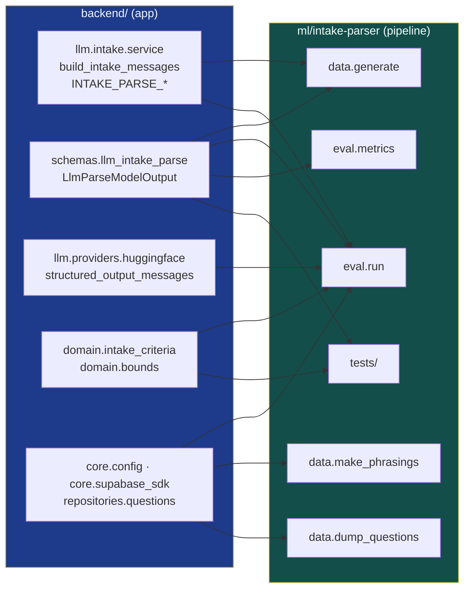

# `ml/intake-parser` — structure

Builds and scores the model behind the **intake criteria parser**: questionnaire dump,
training-data generation, LoRA fine-tuning, merge, GGUF quantization, local serving and
evaluation.

> **Not a model, and not a service.** No weights are tracked here — they live in
> `<repo>/.local/` and on the Hub — and nothing in this tree is deployed. What is tracked
> is the recipe that produces one GGUF and the record of what every candidate scored.

| | |
|---|---|
| Distribution | `consultant-intake-parser` 0.1.0 (hatchling) |
| Import package | `pipeline` |
| Python | ≥ 3.11 |
| Base deps | `openai`, `pydantic` |
| Extras | `train` (torch, transformers, peft, accelerate, gguf, …), `dev` (ruff, pytest, pytest-asyncio, pytest-cov) |
| External dep | `app` — the backend, via `pip install -e ../../backend` |
| Source LOC | 3,753 in `pipeline/`, 2,256 in `tests/` |
| Lint / test | ruff (line 100, `E,F,I,UP`), pytest (`testpaths = ["tests"]`, `asyncio_mode = strict`) |

The directory and the import name differ on purpose: the directory says which model this
is for, the package says what the code is. Every command runs from `ml/intake-parser/`, so
`pipeline` never appears without that directory to qualify it.

---

## 1. Directory layout

Four kinds of thing, four places. The package holds **code only**; datasets, results and
deployment sit beside it.

```
ml/intake-parser/
├── pyproject.toml              # package, extras, ruff + pytest config
├── README.md                   # the operating manual (why, in ~650 lines)
├── STRUCTURE.md                # this file (what, and where)
│
├── pipeline/                   # THE PACKAGE — every entry point is `python -m pipeline.…`
│   ├── paths.py                # every location, resolved once; llama.cpp binary lookup
│   ├── provenance.py           # what a dataset or an adapter was made from
│   │
│   ├── data/                   # everything that produces a file in datasets/
│   │   ├── dump_questions.py   # DB `questions` table  →  questions.json
│   │   ├── make_phrasings.py   # asks a 7B how clients say each property type
│   │   ├── vocabulary.py       # the corpora the generator draws from — data only
│   │   ├── figures.py          # how a number is sampled and written (money vs area)
│   │   ├── fields.py           # gold + wording for one field, always as a pair
│   │   ├── messages.py         # fragments woven into a sentence, then roughed up
│   │   └── generate.py         # composes those into a labelled turn (9 shapes)
│   │
│   ├── train/  train_lora.py (CPU entry point), merge.py (adapter → full weights)
│   ├── quantize/  build_gguf.py, make_imatrix.py
│   ├── serve/  serve_local.py  # llama-server with the flags the eval assumes
│   └── eval/
│       ├── metrics.py          # pure scoring (no network, no config)
│       ├── run.py              # the harness: score any OpenAI-compatible endpoint
│       └── compare.py          # promote / reject / cannot-say gate (McNemar)
│
├── datasets/                   # inputs and generated training data
│   ├── questions.json          # the generated questionnaire — never hand-edited
│   ├── eval.jsonl              # 134 hand-written eval turns, 13 categories
│   ├── train.jsonl             # generated
│   ├── validation.jsonl        # generated
│   ├── property_type_phrasings.json   # build artifact (gitignored)
│   └── dataset_provenance.json # the stamp, beside the data it describes
│
├── results/                    # the lab record
│   ├── results.md              # every model scored, and why  (968 lines)
│   └── <label>.json            # per-turn scores + raw output; new runs gitignored
│
├── deploy/                     # what gets installed on the serving host
│   ├── llama-server.service
│   └── README.md               # deployment, sizing, TLS
│
├── notebooks/train.ipynb       # the Colab GPU training path
└── tests/                      # 7 modules, `pytest` from here
```

Everything multi-gigabyte lives in `<repo>/.local/` (gitignored, outside `backend/` so it
can never be swept into a deploy):

```
<repo>/.local/
├── bin/          llama.cpp release binaries (what the results tables were measured against)
├── llama.cpp/    source checkout, pinned to tag b10290, for convert_hf_to_gguf.py
└── models/       HF snapshots, LoRA adapters, merged weights, *.gguf, imatrix.dat
```

### Why data is not inside the package

`pyproject.toml` builds from `packages = ["pipeline"]`, so anything under it ships with it.
It also settles ownership: `questions.json` is read by both `data` and `eval`, and while it
lived under `eval/` the generator reached sideways into the harness's directory for its own
input. `tests/test_paths.py::TestDataSitsBesideThePackageNotInsideIt` fails if any of it
drifts back.

---

## 2. The pipeline, end to end

Each step's output is the next step's input, and every one is re-runnable from scratch.



Steps 1–2 (`dump_questions`, `make_phrasings`) only re-run when the questionnaire changes.
Steps 3 onward are the loop you iterate on.

---

## 3. Module reference

### `pipeline/paths.py` (78 LOC) — every location, once

Anchors: `PACKAGE_DIR → PROJECT_DIR → REPO_ROOT` (`parents[2]`, asserted in
`tests/test_paths.py` rather than repeated). Derives `BACKEND_DIR`, `LOCAL_DIR`,
`MODELS_DIR`, `LLAMA_BIN_DIR`, `LLAMA_SRC_DIR`, `DATASETS_DIR`, `RESULTS_DIR` and the five
file paths (`QUESTIONS_PATH`, `EVAL_DATASET_PATH`, `TRAIN_PATH`, `VAL_PATH`,
`PHRASINGS_PATH`).

`llama_exe(name)` resolves a llama.cpp binary, **preferring `.local/bin` over `PATH`** — a
system build of another version would produce numbers incomparable with the recorded rows.
Missing binary raises `SystemExit`. Nothing here touches the filesystem at import time.

### `pipeline/provenance.py` (314 LOC) — what a dataset or an adapter was made from

Stdlib only, so a stamp is readable from a checkout with no venv. Two stamp kinds, written
beside the thing they describe: `dataset_provenance.json` and `training_provenance.json`.

| Function | Purpose |
|---|---|
| `write_dataset_stamp(...)` | generator flags (`--count`, `--seed`), input/output sha256 + row counts, git state |
| `write_adapter_stamp(...)` | base model, hyperparameters, versions, and the **dataset stamp copied in** |
| `stamp_says_data_changed(p)` | true only when `dataset_matches_stamp is False` — data regenerated after the stamp |
| `read_stamp` / `flatten` / `differences` | read back and diff two stamps field by field |

CLI: `python -m pipeline.provenance` (list all) · `python -m pipeline.provenance <a> <b>` (diff).
Two rules: **hashes over paths** — which is why existing stamps survived the move to `ml/`
unchanged — and **never fail the job**: every failure degrades to a null.

### `pipeline/data/` — everything that writes to `datasets/`

| File | LOC | Role |
|---|---|---|
| `dump_questions.py` | 72 | `--out`. Writes `questions.json` from the live table. Rewriting it **invalidates the dataset**. |
| `make_phrasings.py` | 212 | Asks a 7B for phrasings per property-type option, then asks the **same** model to map each back (`propose` → `round_trips`). Drops candidates claimed by two options, option words themselves, and anything reaching the eval set. |
| `vocabulary.py` | 323 | The corpora, data only. Nothing here executes and nothing imports anything. |
| `figures.py` | 271 | Sampling and formatting as one decision: `_price_value`/`_fmt_money`, `_sqft_value`/`_fmt_sqft`, `FieldNumbers`, `_range_phrase`. |
| `fields.py` | 257 | `(gold, wording)` for one field: `_place`, `_type_words`, `_field_fragment`, `_bare_answer`, plus `load_phrasings` and `property_type_values`. |
| `messages.py` | 111 | `_connected_sentence`, `_rough_up`, `_add_distractors`. |
| `generate.py` | 508 | Composition and IO: `make_example`, `validate`, `to_chat_record`, `collision_key`, `eval_input_keys`, `main`. |

**The four modules layer strictly downward** — `vocabulary` imports nothing,
`figures` reads `vocabulary`, `fields` reads both, `messages` reads `vocabulary`, and only
`generate` reads all of them. That was checked rather than asserted: the split was derived
from the dependency graph and there are no upward edges, so the layering cannot quietly
become a cycle.

`generate.py` was 1,341 lines before the split, of which `make_example` is still 200 —
it composes every shape and threads prior criteria, the skipped set and the next question
key through all of them, so breaking it further has to preserve draw *order* exactly or
seeded output moves. Worth doing; not free.

**Any change here must leave seeded output byte-identical**, or `datasets/train.jsonl`
silently stops matching the sha256 in `dataset_provenance.json`. Generate a few hundred rows
at fixed seeds before and after and diff the hashes; the test suite alone will not catch it.

`generate.py` flags: `--count` (2500) `--seed` (17) `--val-fraction` (0.1) `--questions`
`--eval-set` `--phrasings` `--out` `--val-out`.

Labels are **correct by construction** — a criteria dict is chosen first, rendered into
natural language, and kept as gold; there is no teacher to be wrong. Prompts come from
`build_intake_messages`, so training text cannot drift from serving text. Nine shapes:
`single`, `multi`, `skip`, `answer-and-skip`, `carried-skip`, `noise`, `complete`,
`correction`, `pending-answer` — the set teaches **precision, not recall** (~27% of
examples gold empty `extracted`).

### `pipeline/eval/` — the harness

| File | LOC | Role |
|---|---|---|
| `metrics.py` | 304 | Pure scoring: `normalize_value`, `values_equal`, `score_turn` → `TurnScore`, `aggregate` → `Aggregate`, `by_category`, `prf`, `percentile`, `markdown_row`. |
| `run.py` | 392 | `run_turn` / `run_dataset` / `production_answer`. Async, `--concurrency`-bounded. Writes `results/<label>.json`, prints the markdown row. |
| `compare.py` | 299 | `mcnemar`, `totals`, `compare`. Exit **0 promote / 1 reject / 2 cannot say**. |

`run.py` flags: `--label` (required) `--model` `--base-url` `--api-key` `--dataset`
`--questions` `--split` `--category` `--limit` `--concurrency` `--timeout`
`--duplicate-schema` `--no-json-mode` `--no-next-question` `--out`.

A results file carries `label, command, model, base_url, split, duplicate_schema,
json_mode, temperature, max_tokens, summary, by_category, turns` — and every turn keeps its
**`raw_output`**, which is where failure modes are actually visible (and which
`tests/test_bound_correction_replay.py` reuses as a free corpus).

`compare.py` exists because the naive gate is wrong: value accuracy runs over ~102
comparisons, so a "regression" of seven items is 0.07. The comparison is **paired** (both
runs scored the same turns), so McNemar's exact test applies; training variance is *not*
measurable from these files, so a difference that clears eval-set noise is still reported
as unattributed.

**The eval set** — `datasets/eval.jsonl`, 134 turns:

| Split | Turns | | Category | Turns |
|---|---|---|---|---|
| `dev` | 92 | | `skip` | 25 |
| `holdout` | 37 | | `unit-ambiguity` | 20 |
| `regression` | 5 | | `multi-field` | 16 |
| | | | `correction` | 11 |
| | | | `single-field` | 10 |
| | | | `bound-direction`, `empty-or-noise`, `previously-skipped` | 8 each |
| | | | `pending-answer` | 7 |
| | | | `property-synonym` | 6 |
| | | | `answer-and-skip`, `complete`, `reported-bug` | 5 each |

Scored runs use `dev` + `holdout` = 129, which is the count `results.md` reports for r7/r8.

### `pipeline/train/` and `pipeline/quantize/`

| File | LOC | Role |
|---|---|---|
| `train/train_lora.py` | 317 | `IntakeDataset`, `PadCollator`, `pick_precision`. Loss on **completion tokens only** (~2.7% of tokens); chat template from the tokenizer, never hand-rolled. |
| `train/merge.py` | 61 | Folds the adapter into base weights — `convert_hf_to_gguf.py` reads full weights, not adapters. |
| `quantize/build_gguf.py` | 191 | `snapshot`, `ensure_convert_script`, `quantize_flags`. Produces the HF snapshot, `*-f16.gguf` and `*-q4_k_m.gguf`. llama.cpp pinned to **`b10290`**. |
| `quantize/make_imatrix.py` | 100 | `build_calibration` renders the **training** split to text — never the eval split — then `llama-imatrix`. |

`train_lora.py` defaults: `--rank 8 --alpha 16 --dropout 0.05 --lr 2e-4 --epochs 2
--batch-size 1 --grad-accum 8 --max-len 1088 --warmup-ratio 0.03 --seed 17`, plus
`--smoke`. (`notebooks/train.ipynb` runs r=16 / alpha=32 / batch 2 × grad-accum 4.)

The F16/Q4 **pair** is the point: measured together, a regression is unattributable.

### `pipeline/serve/` and `deploy/`

`serve_local.py` (109 LOC) starts `llama-server` with the flags a results row depends on:
`-t` = **physical** cores (`physical_cores()`), `--parallel 1`, `--cache-reuse 256`,
`--jinja`, `--ctx-size 4096`, bound to `127.0.0.1:8080`. `deploy/llama-server.service` is
the same binary under systemd with a bearer credential and TLS terminated in front — the
split is deliberate: the script is code and stays in the package, the unit is installed on
a host and does not.



The Vercel function cannot hold the model — no persistent RAM, a bundle limit under 398 MB,
a cold start per request. Only a process that survives between requests keeps the constant
prompt prefix cached, which is most of why intake is fast.

---

## 4. Coupling to the backend

`app` is an ordinary installed distribution here (`pip install -e ../../backend`), not a
`sys.path` hack. **Editable is the point**: a backend prompt change lands in the harness on
the next run rather than drifting. Without the install, every entry point fails at import
with `ModuleNotFoundError: No module named 'app'` — loud, and it names the fix.



| Consumer | Imports from `app` |
|---|---|
| `data/generate.py` | `llm.intake.service.build_intake_messages`, `schemas.llm_intake_parse.LlmParseModelOutput` |
| `data/{vocabulary,figures,fields,messages}.py` | nothing — they depend only on each other and the stdlib |
| `data/make_phrasings.py` | `core.config.settings`, `core.supabase_sdk`, `repositories.questions.list_intake_questions` |
| `data/dump_questions.py` | `core.supabase_sdk`, `repositories.questions.list_intake_questions` |
| `eval/metrics.py` | `schemas.llm_intake_parse.LlmParseModelOutput` |
| `eval/run.py` | `core.config.settings`, `domain.intake_criteria.apply_criteria_filters`, `llm.intake.service.{build_intake_messages, INTAKE_PARSE_TEMPERATURE, INTAKE_PARSE_MAX_TOKENS}`, `llm.providers.huggingface.structured_output_messages`, `schemas.llm_intake_parse.LlmParseModelOutput` |
| `tests/` | `domain.bounds.correct_bound_direction`, `domain.intake_criteria.apply_criteria_filters`, `schemas.llm_intake_parse.LlmParseModelOutput` |

The one thing the harness deliberately does **not** reuse is the provider's reply handling:
it reads `choices[0].message.content` raw, with no fence-stripping and no retry, because raw
JSON validity is one of the numbers being measured.

`ruff.lint.isort.known-first-party = ["app", "pipeline"]` keeps `app` out of the
third-party block — it is an installed distribution, but it is still this repo's code.

---

## 5. Tests

`pytest` from `ml/intake-parser/` — **254 tests**. `testpaths = ["tests"]` in each project
means neither suite collects the other's.

| File | LOC | What it pins |
|---|---|---|
| `test_data_generate.py` | 1172 | Generator invariants: shape mix, the empty-`extracted` share, no key in both `extracted` and `skipped_fields`, eval-set separation (`TestSynonymEvalSeparation`, `TestBoundWordingEvalSeparation`) |
| `test_eval_metrics.py` | 387 | The numbers a published results row is built from |
| `test_provenance.py` | 172 | `--count` reaching the stamp; a stamp noticing its data was regenerated |
| `test_eval_compare.py` | 162 | The gate's job is to be right about *not knowing* |
| `test_regression_turns.py` | 150 | The five reported production bugs — which filters fix, and which need a different model |
| `test_paths.py` | 129 | Repo-root depth as an anchor assertion; **and that datasets/results never drift back under the package** |
| `test_bound_correction_replay.py` | 84 | Replays recorded `results/*.json` output through the bound corrector; correcting must never reduce matches |

---

## 6. Artifacts: what is tracked, what is not

| Artifact | Location | Tracked |
|---|---|---|
| Questionnaire | `datasets/questions.json` | ✅ generated, committed |
| Eval turns | `datasets/eval.jsonl` | ✅ hand-written |
| Training data | `datasets/{train,validation}.jsonl` | ⚠️ in the index despite the ignore rule — see `datasets/.gitignore` |
| Phrasings | `datasets/property_type_phrasings.json` | ⛔ build artifact |
| Provenance stamp | `datasets/dataset_provenance.json` | ✅ |
| Results table | `results/results.md` | ✅ the record |
| Run results | `results/<label>.json` | ⛔ new runs gitignored; committed rows stay tracked |
| Deployment unit | `deploy/llama-server.service` | ✅ |
| Weights, adapters, GGUFs, llama.cpp | `<repo>/.local/` | ⛔ Hub or object storage |

Two conventions that carry real cost when broken: **give every eval run a label no
`results/` file already owns** (a rebuild overwrites silently), and **rows from different
`eval.jsonl` revisions are not comparable and must not share a table**.

---

## 7. Entry points, at a glance

```bash
cd ml/intake-parser
pip install -e ../../backend && pip install -e .           # `app` and `pipeline`

python -m pipeline.data.dump_questions                     # DB → datasets/questions.json
python -m pipeline.data.make_phrasings --model qwen/qwen-2.5-7b-instruct
python -m pipeline.data.generate --count 2500
python -m pipeline.train.train_lora --smoke                # or notebooks/train.ipynb on Colab
python -m pipeline.train.merge   --adapter … --out …
python -m pipeline.quantize.build_gguf   --model …
python -m pipeline.quantize.make_imatrix --gguf …          # measured: does not pay
python -m pipeline.serve.serve_local --model …q4_k_m.gguf
python -m pipeline.eval.run --label … --split all --no-next-question --base-url … --model …
python -m pipeline.eval.compare <baseline> <candidate>     # 0 promote / 1 reject / 2 cannot say
python -m pipeline.provenance                              # every stamp found
pytest
```

`README.md` is the manual — it explains *why* each of these is shaped the way it is, and
most of what it says exists because of a number in `results/results.md`. Read that table
before changing anything here.
